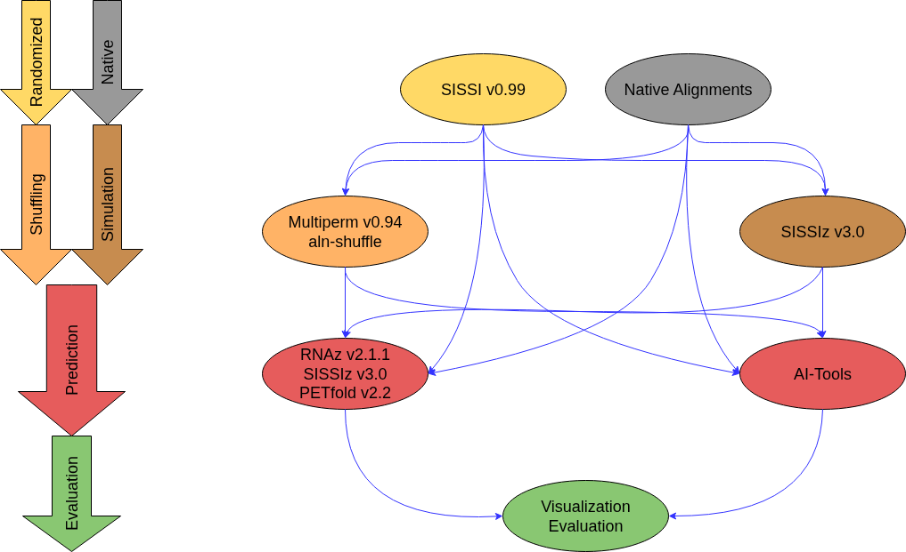

# SDSP Pipeline

**Simulation, Destruction and Structure Prediction Pipeline**

## 📌 Overview

The SDSP pipeline is a bioinformatics workflow for simulating, randomizing, and analyzing non-coding RNA genes (ncRNA genes) in multiple sequence alignments (MSAs). The pipeline focuses on disrupting RNA secondary structures and identifying conserved structural signals using comparative RNA prediction tools.

The pipeline consists of four major stages:

1. **Simulation** of RNA sequence alignments using *SISSI*
2. **Structure destruction / randomization / shuffling** using *SISSIz*, *Multiperm*, and *aln-shuffle*
3. **Genefinding of ncRNA with predition tools** using *SISSIz*, *RNAz*, and *PETfold*
4. **Performance evaluation** using statistical analysis and visualization methods

The primary goal of this pipeline is to compare different randomization and prediction approaches for conserved non-coding RNA (ncRNA) structures.

---

## 🧰 Tools

Most tools used in this pipeline are publicly available and can be downloaded from their official sources.

The following software versions were used:

* SISSI 0.99
* SISSIz 3.0
* Multiperm 0.94
* aln-shuffle
* RNAz 2.1.1
* PETfold 2.2

---

## ⚙️ Pipeline Workflow



The SDSP pipeline performs the following workflow:

### 1. Simulation of Positive Datasets

Positive RNA alignments are generated using *SISSI* based on predefined nucleotide frequency distributions and phylogenetic models.
Approximately **100,000 simulated alignments** are generated per parameter configuration.

### 2. Generation of Negative Datasets

Negative control datasets are created from the positive alignments using different randomization approaches:

* **SISSIz** (mono- and dinucleotide preserving simulations)
* **Multiperm**
* **aln-shuffle**

These methods disrupt conserved RNA secondary structures while preserving specific sequence characteristics such as nucleotide composition.

### 3. Genefinder and Prediction tools

The generated alignments are analyzed using:

* *SISSIz*
* *RNAz*
* *PETfold*

The tools evaluate structural conservation, thermodynamic stability, and statistical significance to identify potential ncRNA structures.

### 4. Evaluation and Visualization

The prediction results are analyzed in Python using:

* pandas
* numpy
* matplotlib
* seaborn
* scikit-learn

The evaluation includes:

* boxplots
* confusion matrices
* ROC curves
* classification metrics

This enables a systematic comparison of different null models and RNA prediction tools.

---

## 🚀 Usage

### 1. Clone the Repository

```bash
git clone https://github.com/Faragas91/SDSP-Pipeline.git
cd SDSP-Pipeline
```

---

### 2. Create the Conda Environment

```bash
conda env create -f environment.yml
conda activate sdsp_pipeline
```

---

### 3. Install Required Programs

Install all required external tools (*SISSI*, *SISSIz*, *RNAz*, *PETfold*, etc.) and ensure they are either:

* available in your system `PATH`, or
* correctly configured in the pipeline configuration files.

---

### 4. Configure the Pipeline

Adjust the example configuration files according to your local installation paths and desired execution mode.

```bash
nano config/pipeline_sissi.conf.example
nano config/pipeline_native.conf.example
```

After editing the files, rename them:

```bash
mv config/pipeline_sissi.conf.example config/pipeline_sissi.conf
mv config/pipeline_native.conf.example config/pipeline_native.conf
```

---

### 5. Run the Pipeline

The pipeline supports three execution modes:

| Mode     | Description                    |
| -------- | ------------------------------ |
| `native` | Run only native datasets       |
| `sissi`  | Run only simulated datasets    |
| `both`   | Run both datasets sequentially |

Example:

```bash
./pipeline.sh both
./pipeline.sh native
./pipeline.sh sissi
```

---

## 📊 Results

All generated prediction and evaluation results are stored in the `results/` directory.

### Prediction Results

```bash
results/native/
results/sissi/
```

### Excel Files

```bash
results/native/*/excel
results/sissi/*/excel
```

---

## 📈 Generated Plots

All generated visualizations are stored in the `images/` directory.

```bash
images/native/
images/sissi/
```

The generated plots include:

* ROC curves
* confusion matrices
* histograms
* boxplots
* runtime comparisons

---

## ❗ Troubleshooting

If you encounter issues during installation or execution of the pipeline, please open an issue in the GitHub repository.

Bug reports, suggestions, and improvements are highly appreciated.

---

## 📖 Citation

If you use this pipeline in scientific work or publications, please cite the repository appropriately.

---

**Author:** Stefan Redl
